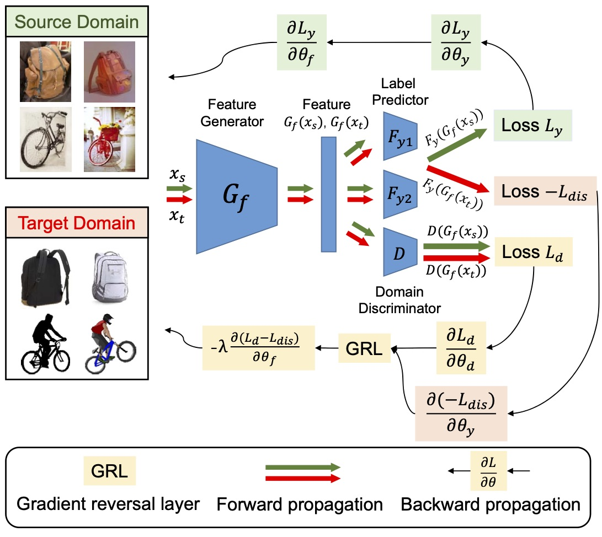

# Joint Adversarial Domain Adaptation

### Paper



[Joint Adversarial Domain Adaptation](https://dl.acm.org/doi/10.1145/3343031.3351070)  

[Shuang Li](http://shuangli.xyz), [Chi Harold Liu](http://cs.bit.edu.cn/szdw/jsml/js/lc_20180927062826951290/index.htm), [Binhui Xie](https://binhuixie.github.io), [Limin Su](https://sulimin.tech/), [Zhengming Ding](http://allanding.net), [Gao Huang](http://gaohuang.net/)

(Proceedings of the 27th ACM International Conference on Multimedia, 2019)


### Abstract
Domain adaptation aims to transfer the enriched label knowledge from large amounts of source data to unlabeled target data. It has raised significant interest in multimedia analysis. Existing researches mainly focus on learning domain-wise transferable representations via statistical moment matching or adversarial adaptation techniques, while ignoring the class-wise mismatch across domains, resulting in inaccurate distribution alignment. To address this issue, we propose a *Joint Adversarial Domain Adaptation (JADA)* approach to simultaneously align domain-wise and class-wise distributions across source and target in a unified adversarial learning process. Specifically, JADA attempts to solve two complementary minimax problems jointly. The feature generator aims to not only fool the well-trained domain discriminator to learn domain-invariant features, but also minimize the disagreement between two distinct task-specific classifiers' predictions to synthesize target features near the support of source class-wisely. As a result, the learned transferable features will be equipped with more discriminative structures, and effectively avoid mode collapse. Additionally, JADA enables an efficient end-to-end training manner via a simple back-propagation scheme. Extensive experiments on several real-world cross-domain benchmarks, including VisDA-2017, ImageCLEF, Office-31 and digits, verify that JADA can gain remarkable improvements over other state-of-the-art deep domain adaptation approaches.


### Getting Started
The code is implemented with Python (3.6) and Pytorch (1.0.0)

To install the required python packages, run

``pip install -r requirements.txt``


#### Datasets

Office-31 dataset can be found [here](https://people.eecs.berkeley.edu/~jhoffman/domainadapt/).

ImageCLEF dataset can be found [here](https://imageclef.org/2014/adaptation)

VisDA 2017 dataset can be found [here](https://github.com/VisionLearningGroup/taskcv-2017-public) in the classification track.

#### Training
- Office-31
```
$ bash train_office31.sh
```

- ImageCLEF
```
$ bash train_clef.sh
```

### Acknowledgements
This code is heavily borrowed from [Xlearn](https://github.com/thuml/Xlearn) and [CDAN](https://github.com/thuml/CDAN).

### Citation
If you find this code useful for your research, please cite our [paper](https://dl.acm.org/doi/10.1145/3343031.3351070):
```
@inproceedings{li2019joint,
author = {Li, Shuang and Liu, Chi Harold and Xie, Binhui and Su, Limin and Ding, Zhengming and Huang, Gao},
title = {Joint Adversarial Domain Adaptation},
year = {2019},
booktitle = {Proceedings of the 27th ACM International Conference on Multimedia},
pages = {729–737},
numpages = {9}
}
```

### Contact

If you have any problem about our code, feel free to contact
- shuangli@bit.edu.cn
- binhuixie@bit.edu.cn

or describe your problem in Issues.
